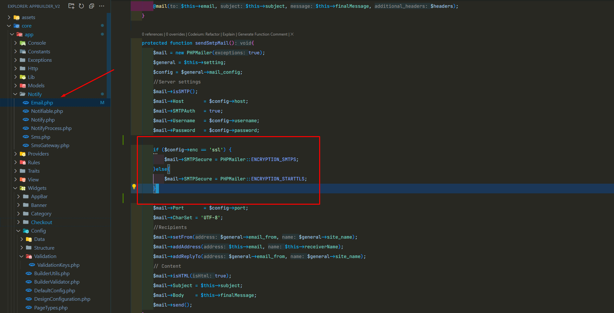

### Send email to mailhog smtp in laravel

1. Setup config to send mail(it does not support tls/ssl), username, and password. So please configure the config accordingly:

2. Disable the encryption field as I mentioned above

3. Open the browser: localhost:8025 and you are good to go